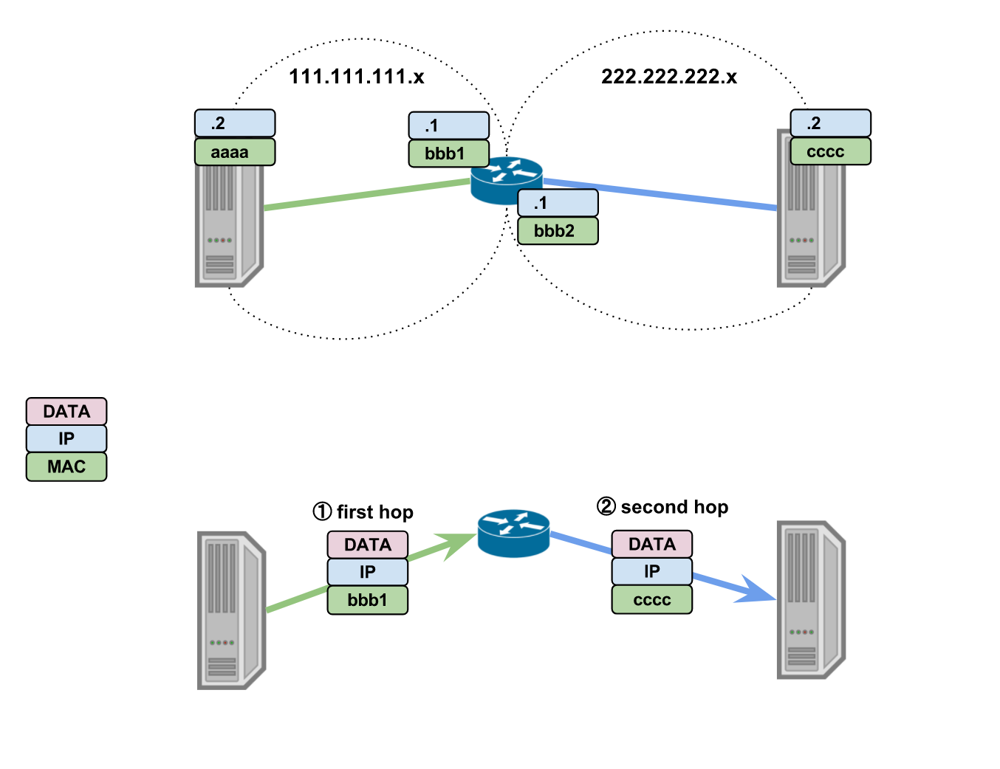
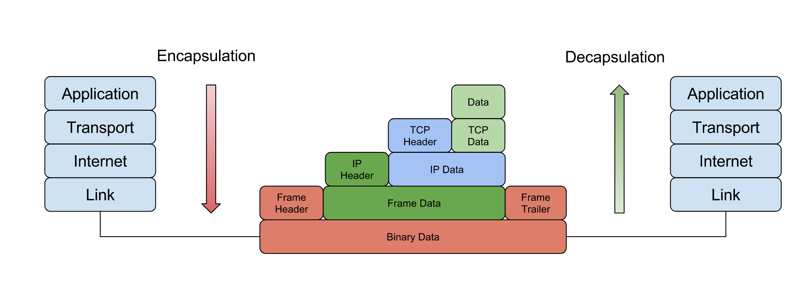
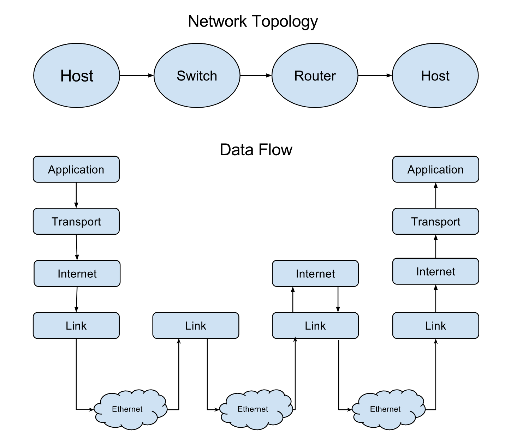

# TCP/IP 协议栈

最后更新时间：`2017-09-02`

标签：`Network` `TCP/IP`

## 1. 引言

在现实场景中，我们并不会使用教科书般的 OSI 网络模型，而是 TCP/IP 模型。

所以暂时忘记 OSI 模型吧，本文将从数据包传输的过程来分析 TCP/IP 模型。

## 2. TCP/IP 协议栈

TCP/IP 模型是一个抽象的分层模型，其中每一层都是对协议和服务的抽象，而且每一层同时也会为高一层提供服务，从而达到协议之间的协同工作。

根据 [RFC 1122](https://tools.ietf.org/html/rfc1122) 的协议规范，TCP/IP 模型定义了四层结构，自上而下分别是  **Application**, **Transport**,  **Internet** 和 **Link** 层。 将 TCP/IP 协议族抽象到这四层中，由于层级之间可以相互协作，因此 TCP/IP 协议族也被称为 TCP/IP 协议栈。

接下来将自下而上地介绍这四层结构。

### 2.1 Link Layer

Link 层负责从网卡读取数据以及通过网卡发送数据，其中采用 **Frame** 来对数据进行封装。

```
      +--------+------+---------+
Frame | Header | Data | Trailer |
      +--------+------+---------+
```

Frame 包含了很多控制信息，其中包含源/目的 MAC 地址，因此 Link 层只是负责在**直接连通的网卡之间**传递数据包。

> 主机 A 通过交换机连通主机 B，那么主机 A 和 主机 B 的网卡之间是互通的。

在一个连通的网络拓扑图中，发送节点和接收节点并不会直接相连。在实际数据传输过程中，数据包将会以**跳跃**的方式传递，而目的 MAC 地址代表着下一跳，并不代表最终的目的地。

因此想要实现多次**跳跃**，上层协议需要提供一个**最终目的地**。


### 2.2 Internet Layer

Link 层使用 MAC 地址作为目的地的定位，解决了单一网络内的数据包传输。但是互联网并不只是一个网络，MAC 地址解决不了不同网络中的主机通信问题，数据包需要多次**跳跃**。 

Internet 层引入了 IP 地址来解决不同网络之间的通信问题。

Internet 层采用 **Packet** 来对数据进行封装, 而 Packet 将会被 Link 层封装成 Frame 进行传输。

```
                 +-----------+------+
Packet           | IP Header | Data |
                 +-----------+------+

        +--------+------------------+---------+
Frame   | Header | Packet           | Trailer |
        +--------+------------------+---------+
```

在封装上层数据时，Internet 层会将源和目的主机的 IP 地址放入 IP Header 中。 当数据包需要多次**跳跃**时，中间的跳板节点将会扮演路由的角色，它们将会通过目的 IP 地址来决定下一跳的 MAC 地址。因此在整个传输跳跃过程中，目的 MAC 地址会一直发生变化。

> 一般情况下，目的 IP 是不会发生改变，除了 Network Address Translation 场景。



如上图所示，`111.111.111.2` 的主机想要访问 `222.222.222.2` 的主机，而两个主机之间并没有直接连接，中间隔了个路由器，因此 `111.111.111.2` 发出的数据包中的 MAC 地址不能设置成  `cccc` ，而是需要先到达路由器。路由器接收到数据包以后，解析数据包，发现目的 IP 地址不是自己，而是 `222.222.222.2` ，路由器会把目的 MAC 地址改成 `cccc` 再发出去。在目的 IP 地址的定位下，数据包就可以到达最终的目的地，两个主机之间就可以建立起 Internet 层面的信道。

但是主机上会有多个进程，每个进程都有可能使用同一个通道。因此为了区分不同目的的通信信息，还需要引入新的定位方法。


### 2.3 Transport Layer

为了解决不同进程使用同一信道会出现冲突的问题， Transport 层引入了**端口号**作为数据包的标识。在同一个 Internet 层的信道上，目的端口号可以唯一标识数据包，即多路复用。这样，两个主机之间的进程就可以相互通信了。

其中 Transport 层采用 **Segment** 结构来对数据进行封装, 而 Segment 将会被 Internet 层封装成 Packet。

```
                    +------------+------+
Segment             | TCP Header | Data |
                    +------------+------+

        +-----------+-------------------+
Packet  | IP Header | Segment           |
        +-----------+-------------------+
```


### 2.4 Application Layer

Application 层位于最高层，是数据的生产方和消费方。通常情况下，应用程序通过会采用 HTTP, HTTPS, SSH 等协议来封装数据，当然应也可以选择不封装具体的数据，直接交给 Transport 层。

## 3. 总结

发送端的数据会自上而下地穿过 TCP/IP 协议栈，最后会以 Frame 结构在网络中传输。当数据包到达接收端时，数据包同样会自下而上地穿过协议栈，接收端的应用程序最后会拿到封装之前的数据。总体来说，整个数据包传输的过程就是在不断地装箱和拆箱，如下图所示。



在 MAC 地址的基础之上，TCP/IP 模型还引入了 IP 地址和端口号来标识数据包。因此在传输的过程中，数据包会被交换机或者路由器**拆箱**查看 MAC 地址和 IP 地址来决定下一个传输点，保证数据包能最终到达目的地，如下图所示。



> 在数据包在传输过程中，交换机只负责转发 Frame，并不会改变目的 MAC 地址；而路由器会根据 IP 地址来改变目的 MAC 地址。

## 4. 参考

* [Internet Protocol Suite](https://en.wikipedia.org/wiki/Internet_protocol_suite)
* [RFC 1122](https://tools.ietf.org/html/rfc1122)
